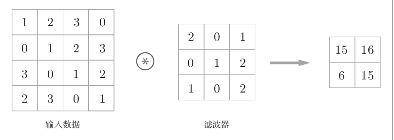
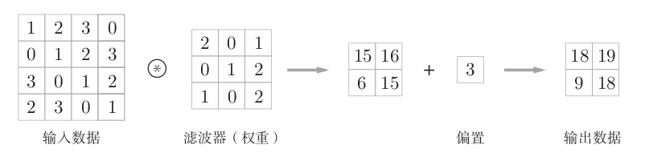
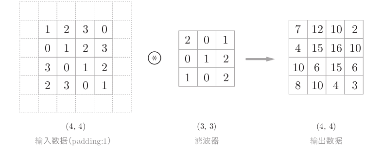
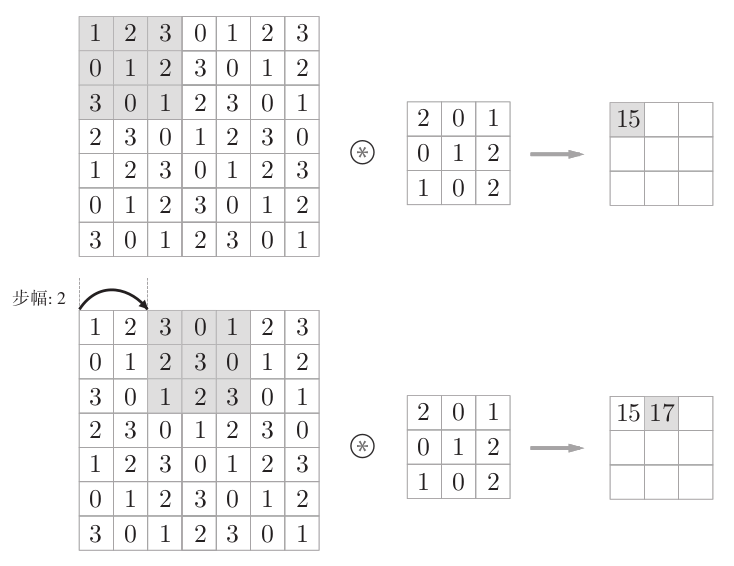
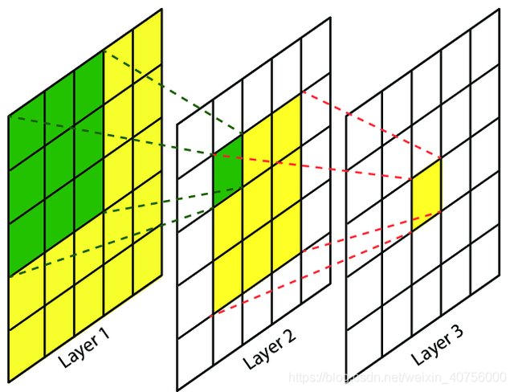
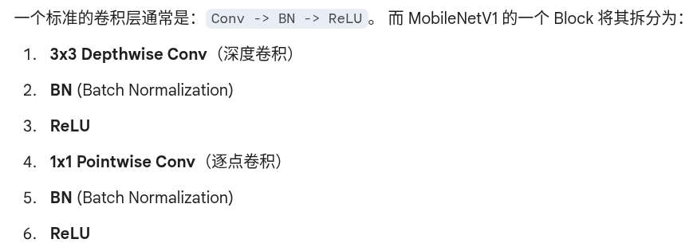

## 1.卷积神经网络
> 全连接神经网络完全忽视了数据的形状，把所有数据视为有关联，显然这样的效果并不好。CNN更注重局部特征提取，有效的解决了这个问题。[CNN笔记：通俗理解卷积神经网络_cnn卷积神经网络-CSDN博客](https://blog.csdn.net/v_july_v/article/details/51812459?ops_request_misc=elastic_search_misc&request_id=45227353d934ed42bb3fe5bf0ea29dfb&biz_id=0&utm_medium=distribute.pc_search_result.none-task-blog-2~all~top_positive~default-1-51812459-null-null.142^v102^pc_search_result_base8&utm_term=CNN&spm=1018.2226.3001.4187)
>
> [六万字硬核详解：卷积神经网络CNN（原理详解 + 项目实战 + 经验分享）_cnn卷积神经网络-CSDN博客](https://blog.csdn.net/shinuone/article/details/127289512?ops_request_misc=elastic_search_misc&request_id=f360251b95fff71f0eb91e9c6220844e&biz_id=0&utm_medium=distribute.pc_search_result.none-task-blog-2~all~top_positive~default-1-127289512-null-null.142^v102^pc_search_result_base8&utm_term=cnn%E5%8D%B7%E7%A7%AF%E7%A5%9E%E7%BB%8F%E7%BD%91%E7%BB%9C&spm=1018.2226.3001.4187)
>

### 1.1.卷积神经网络的基本组成

> 补充数学上的卷积概念：**所有过去的事件 **$f(t)$**，经过了 **$x-t$** 这么长的时间流逝后，叠加在当前**$x$** 时刻的总残留。
>
> 数学上的卷积需要翻转，但本质上都是把一个东西（信号/图像）放在另一个东西（函数/卷积核）里过一遍，看看会发生什么叠加效果
>

###### 1.1.2.填充
+ 在卷积层处理之前，向输入数据填充周围数据（比如0）的操作。
+ 使用填充的主要目的是为了调整输出的大小，这样就可以在保持空间大小的不变的情况下把数据传递给下一层

###### 1.1.3.步幅
+ 就是在进行卷积操作的时候`kernel`移动的距离

###### 1.1.4.感受野
+ 感受野是卷积神经网络（CNN）中，特征图（Feature Map）上的一点，对应到原始输入图像（Input Image）上的区域。  
+ **趋势：** 网络越深，感受野越大  
+ **作用：小感受野看细节，大感受野看整体。** 只有感受野足够大，覆盖了目标物体的关键部分，网络才能做出正确的判断

##### 1.1.2 激活函数层（RELU层）
+ 和神经网络中概念一致

##### 1.1.3 池化层（Pooling层）
+ 简单来说，就是压缩图像，在区域中取最大或者取平均
+ 从上面的描述中，可以看出，池化层不同于卷积层，没有需要训练的参数
+ 池化后通道数不会发生改变
+ 可以说，进行池化操作后，能提升处理的鲁棒性，过滤掉较小的噪声

### 1.2.输出尺寸的计算
$ H_{out} = \left\lfloor\frac{H_{in} - K + 2P}{S} + 1\right\rfloor $（其中 K 是核大小，P 是填充，S 是步幅，$ \lfloor \cdot \rfloor $表示向下取整）

### 1.3.卷积层的训练
+ 前向传播过程还是和FCNN一致，随后计算误差，反向传播过程算出梯度
+ CNN的特性：权重共享->梯度累加，然后进行调整

$ w_{new} = w_{old} - \eta \cdot \nabla w_{total} $

### 1.4.mobilenetV1
[经典CNN模型（七）：MobileNetV1（PyTorch详细注释版）-CSDN博客](https://blog.csdn.net/qq_51872445/article/details/140616978?ops_request_misc=elastic_search_misc&request_id=f81facfdd6b808f4b5dc9dd17ee4229b&biz_id=0&utm_medium=distribute.pc_search_result.none-task-blog-2~all~top_positive~default-1-140616978-null-null.142^v102^pc_search_result_base8&utm_term=mobilenetV1&spm=1018.2226.3001.4187)

#### 1.4.1.mobilenetV1的网络结构

> 其中，BN是将上一层的数据强行归一化的操作，用于整理数据分布
>

#### 1.4.2.总结
+ 用 **深度可分离卷积 (Depthwise Separable Conv)** 替代标准卷积，极大减少了计算量
+ 用 **1x1 卷积** 来负责通道间的信息交流

