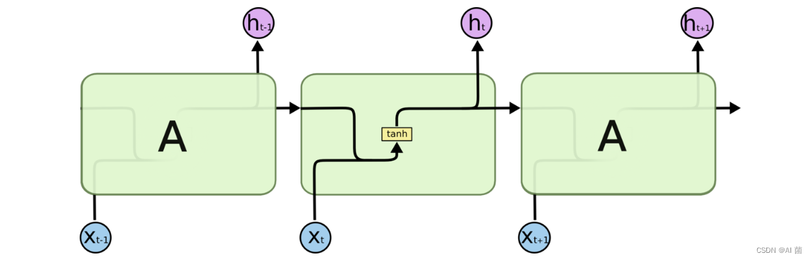
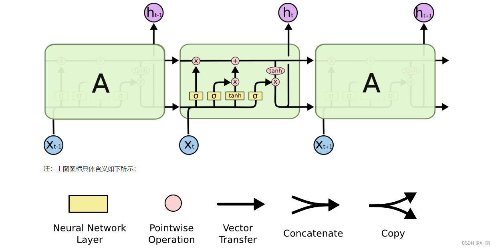

## 1.基本概念/是什么
- RNN 循环神经网络，Recurrently Neural Networks
- 简短概括：区别于古早的模型，这是一个通过循环来实现关联上下文的网络模型
## 2.RNN是怎么实现的？
$$h_t = \tanh(W_{ih} x_t + b_{ih} + W_{hh} h_{t-1} + b_{hh})$$
上面的是RNN的基本公式，其中$x_t和h_{t-1}$是输入，分别代表当前输入和上一时刻的记忆，然后通过加权求和的方式实现结合，最后基于当前的记忆$h_t$输出$y_t$
### 2.1.权重
- **$W_{ih}$ (Input-to-Hidden)**：

    - **位置**：连接当前输入 $x_t$ 到当前隐藏状态 $h_t$。

    - **作用**：负责从当前输入中提取特征。

- **$W_{hh}$ (Hidden-to-Hidden)**：

    - **位置**：连接上一时刻隐藏状态 $h_{t-1}$ 到当前隐藏状态 $h_t$。

    - **作用**：这是**记忆的载体**。它决定了旧的记忆如何影响现在的理解。

- **$W_{ho}$ (Hidden-to-Output)**：

    - **位置**：连接隐藏状态 $h_t$ 到输出 $y_t$。

    - **作用**：负责把脑子里的"想法"转换成最终的预测。
### 2.2.结构
可以看到，其实第一层和最后一层都是基础神经网络，然后中间链接了一个循环的架构，然后由于主题的循环的部分只用一个权重，所以说需要计算的权重最后只有三个

## 3.缺点
### 3.1.梯度消失
之前在[神经网络基础](神经网络.md)中提过梯度的计算方法，这里举例
我们要计算损失 $L$ 对第一层权重 $w_1$ 的导数，根据链式法则：

$$\frac{partial L}{partial w_1} = \frac{partial L}{partial x_n} \cdot \frac{partial x_n}{partial z_{n-1}} \cdot \frac{partial z_{n-1}}{partial x_{n-1}} \cdot \dots \cdot \frac{partial x_2}{partial z_1} \cdot \frac{partial z_1}{partial w_1}$$

Sigmoid 函数的表达式为 $\sigma(x) = \frac{1}{1 + e^{-x}}$。它的导数公式是：

$$\sigma'(x) = \sigma(x)(1 - \sigma(x))$$

这个导数的**最大值只有 0.25**（当 $x=0$ 时）。
所以这段东西最后小于1/4的n次方，超级小，浅层神经元就基本不更新了
## 4.改进款-LSTM

通过架构图可以看到，这个改进款有三个门
1. **遗忘门**：$f_t = \sigma(W_f \cdot [h_{t-1}, x_t] + b_f)$
2. **输入门**：$i_t = \sigma(W_i \cdot [h_{t-1}, x_t] + b_i)$
3. **细胞更新**：$C_t = f_t * C_{t-1} + i_t * \tilde{C}_t$ （这就是那个"传送带"的更新）
4. **输出门**：$o_t = \sigma(W_o \cdot [h_{t-1}, x_t] + b_o)$
### 遗忘门 (Forget Gate)

- **作用**：决定上一时刻的哪些信息不再重要，需要从细胞状态中丢弃。

- **逻辑**：它查看上一时刻的输出 $h_{t-1}$ 和当前输入 $x_t$，通过一个 Sigmoid 激活函数输出一个 0 到 1 之间的值。1 代表"完全保留"，0 代表"彻底忘记"。

### 输入门 (Input Gate)

- **作用**：决定哪些新信息需要存入细胞状态。

- **逻辑**：它包含两部分。一部分用 Sigmoid 决定"更新哪些值"，另一部分用 tanh 创建一个"备选更新向量"。

### 输出门 (Output Gate)

- **作用**：基于目前的细胞状态，决定当前时刻应该输出什么。

- **逻辑**：它过滤细胞状态，确保只把当前任务需要的那部分信息作为隐藏状态 $h_t$ 传递下去。
### 评价LSTM
这个玩意通过遗忘门来保留重要信息，从而实现了减缓梯度消失的问题，大幅提高了记忆力
缺点也很明显，就是多加了一个需要计算的参数，还有就是对比后面要讲的transformer，LSTM由于继承RNN，就是必须要以时间为顺序进行计算