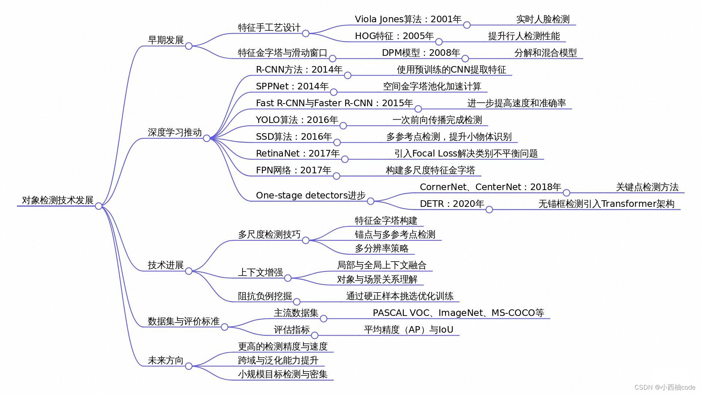
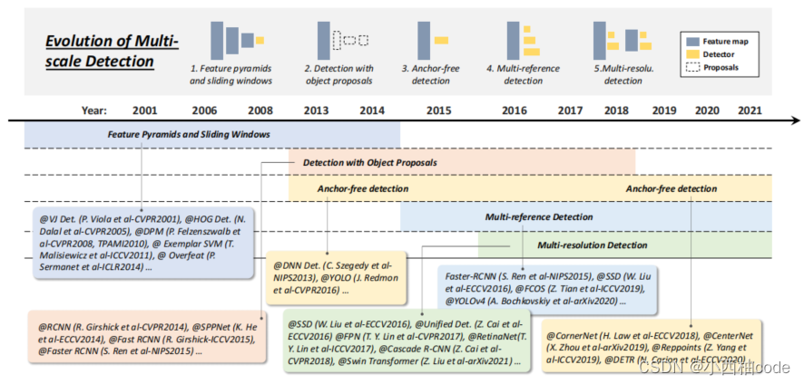

## 1.目标检测
[《Object Detection in 20 Years: A Survey》论文超详细解读（翻译＋脑图）-CSDN博客](https://blog.csdn.net/m0_52275819/article/details/139741001)

[原论文](https://levir.buaa.edu.cn/publications/od_survey.pdf)

> 主要选择了论文的第二部分进行阅读，大致了解这20年里的目标检测
>

### 1.1.传统检测器
#### 1.1.1.Viola-Jones检测器 
+ Viola-Jones（VJ）检测器遵循了一种最直接的检测方式，即滑动窗口法：遍历图像中所有可能的位置和尺度，检查是否任一窗口包含人脸
+ 特点：用黑白度来判断图像是否属于人脸

#### 1.1.2.HOG检测器
+ 方向梯度直方图（Histogram of Oriented Gradients, HOG）。HOG描述符设计为在均匀间隔的密集网格上的单元格上计算，并采用重叠局部对比度归一化（在“块”上）。
+ HOG主要是为了解决行人检测问题
+ 特点：不看颜色，算线条走向，根据形状来判断

#### 1.1.3.可变形部件模型（DPM）
+ DPM是传统物体检测方法的缩影，作为HOG检测器的扩展。
+ 它遵循“分而治之”的检测理念，训练过程可以简单理解为学习一种适当的对象分解方法，推理过程则视为在不同物体部件上的检测结果集成。

### 1.2.深度学习
#### 1.2.1.**两阶段检测器**（Two-Stage）
> 两阶段检测器将检测过程构架为粗到精，先进行区域提议，再进行分类和回归
>
> 提案就是初步筛选，就是把无关的东西取出，把可能的东西框选出来进行下一部分的处理
>

##### 1.2.1.1.R-CNN
`Region-based Convolutional Neural Network`

+ R-CNN的基本思想直观明了：首先利用选择性搜索提取一组物体候选框（提案）。接着，每个候选框被调整到固定尺寸并输入到预训练于ImageNet（如AlexNet）的CNN中提取特征。最后，使用线性支持向量机（SVM）分类器预测每个区域内的物体存在与否及识别物体类别。
+ 缺点：对大量重叠提案（一张图片超过2000个框）进行冗余特征计算导致检测速度极慢（GPU上每张图片需要14秒）

##### 1.2.1.2.**SPPNet**
+ SPPNet的主要贡献在于引入了空间金字塔池化（SPP）层，使得CNN能够在不改变图像或感兴趣区域尺寸的情况下生成固定长度的表示
+ 尽管SPPNet有效提升了检测速度，但其训练仍然是多阶段的，且仅微调全连接层，忽略了之前的所有层

##### 1.2.1.3.**Fast R-CNN**
+ 这是对R-CNN和SPPNet的进一步改进。Fast R-CNN允许在相同的网络配置下同时训练检测器和边界框回归器
+ 虽然Fast R-CNN成功整合了R-CNN和SPPNet的优点，但其检测速度仍受制于提案生成环节

##### 1.2.1.4.**Faster R-CNN**
+ Faster R-CNN的主要创新在于引入了区域提案网络（Region Proposal Network, RPN），几乎免费地提供了区域提案。

##### 1.2.1.5.**特征金字塔网络（FPN）**
+ 尽管CNN深层的特征有利于类别识别，却不利于物体定位。为此，FPN设计了一种自顶向下的架构并辅以横向连接，以便在所有尺度上构建高层次语义。
+ 有效解决了**多尺度检测**问题，特别是显著提升了对**小目标**（Small Objects）的检测精度。

~~不得不说取名字这一块确实有点随便~~

#### 1.2.2.单阶段检测器
> 一个字：快
>

##### 1.2.2.1.**You Only Look Once（YOLO）**
+ YOLO与两阶段检测器完全不同，它将单一神经网络应用于整个图像，将图像划分为区域并同时预测每个区域的边界框和概率。尽管检测速度大幅提升，YOLO在定位准确性上相比两阶段检测器有所下降，特别是在一些小物体上。
+ YOLO进化史（大概）：
    - v1
    - v2引入隔壁Faster R-CNN的Anchor，准备了标准框，在这些标准框上微调
    - v3引入了FPN的思路，解决多尺度检测问题
    - v4/v5 在训练的时候把照片拼贴在一起，增强了训练；自适应锚框
    - v8不用Anchor，直接预测物体的中心点在那里。效率和准确率相对v5更高
    - v11整体和v8一致，新增了**PSA (Partial Self-Attention)空间注意力；**使用更少的参数，但精度更高

##### 1.2.2.2.SSD
+ SSD的主要贡献在于引入了多参考和多分辨率检测技术（将在第二部分C1节介绍），显著提高了单阶段检测器的检测精度，特别是对于小物体。

##### 1.2.2.3.RetinaNet
+ 用焦点损失（Focal Loss）强迫电脑把注意力集中在难以分辨的图像上，以提高准确率

### 1.3.物体检测数据集与评估指标
#### 1.3.1.数据集
> 下面列举几个比较知名的数据集
>

+ Pascal VOC
    - 经典&简单
    - 考20种东西
+ MS COCO（微软COCO）
    - 难
    - 考80种东西

#### 1.3.2.评估指标
+ IoU（交并比）
    - 指的是预测的框和实际的框的交集的大小
    - 使用预测框与真实标注框之间的交并比（Intersection over Union, IoU）来判断其是否大于一个预设的阈值，比如0.5。如果大于这个阈值，则认为物体被“检测到”，否则视为“漏检”
+ mAP（平均精度均质）
    - 指的是该模型对于不同对象的识别的平均精度

### 1.4.物体检测中的技术演进
> 这里有好多都看不懂，选了几种稍微接触到的写一写
>

#### 1.4.1.多尺度检测
+ 对具有“不同尺寸”和“不同宽高比”的物体进行多尺度检测是物体检测中的主要技术挑战之一
+ 目前最优的方法就是FPN

#### 1.4.2.上下文预处理
+ 视觉对象通常嵌入在与周围环境相关的典型上下文中。我们的大脑利用对象和环境之间的关联来促进视觉感知和认知

#### 1.4.3.非极大值抑制NMS
+ 贪心法：对于一组重叠的检测结果，选择具有最大检测得分的边界框，同时根据预定义的重叠阈值移除其邻近的边界框
+ 边界框聚合：将多个重叠的边界框合并或聚类为一个最终的检测结果
+ 基于学习的NMS：其主要思想是将NMS视为一个过滤器，重新对所有原始检测进行打分，并以端到端的方式训练NMS作为网络的一部分，或者训练一个网络模仿NMS的行为
