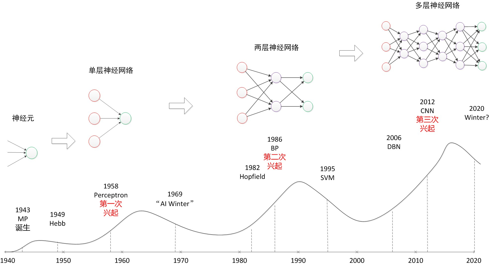
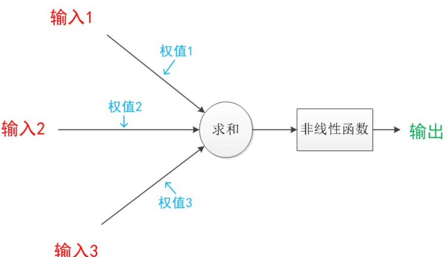
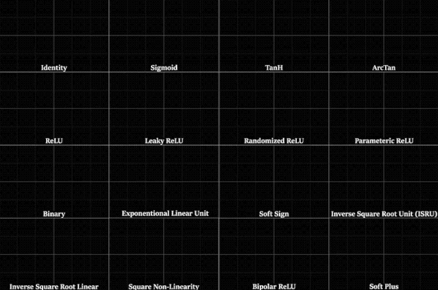
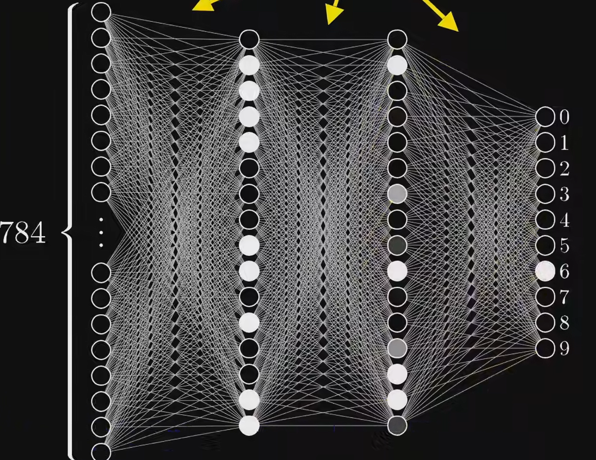
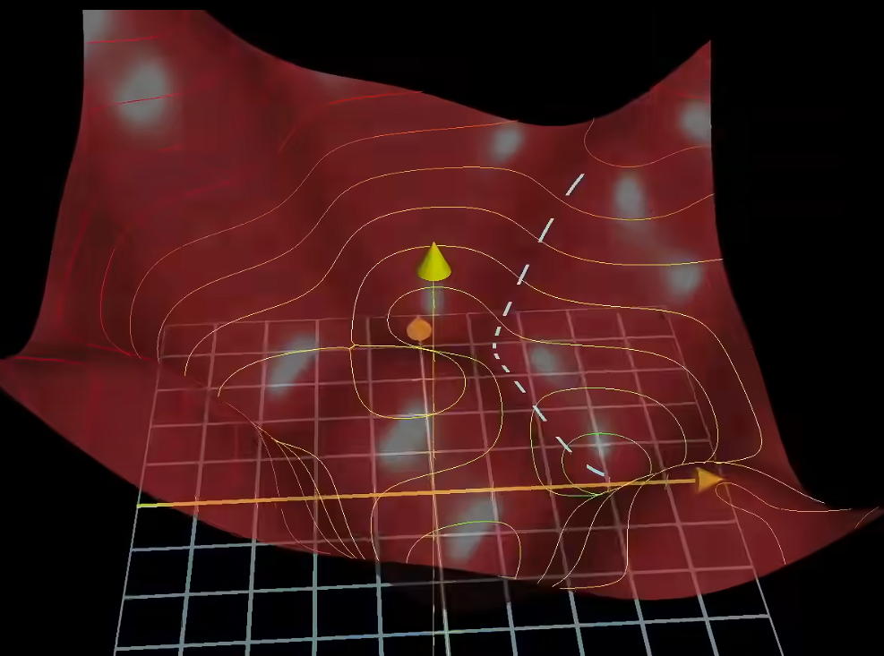
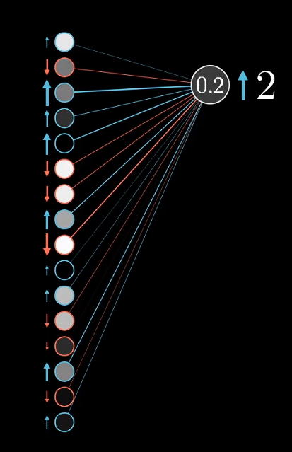
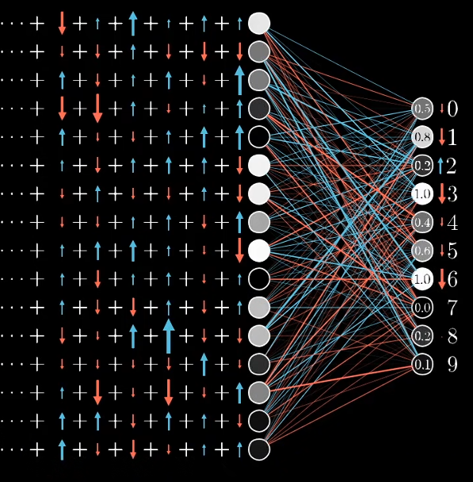
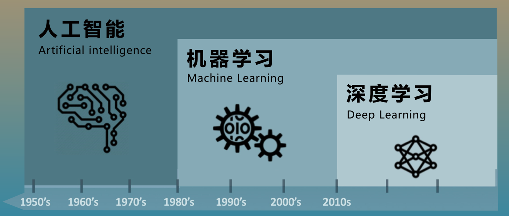

## 1.神经网络的发展历史
1. **M-P 模型 (1943):** 心理学家 McCulloch 和数学家 Pitts 提出了第一个神经元数学模型。他们想证明：大脑的神经元就像是逻辑电路中的“开关”，通过组合可以完成逻辑运算。后来，神经元成为了神经网络的基础
2. **感知机 (Perceptron, 1957):** Rosenblatt 发明了感知机，这是第一个能够“学习”权重的模型。它接收多个输入信号，通过加权求和与阈值比较，输出二元分类结果（0 或 1）。
3. **阻碍 :** 人工智能先驱 Minsky 和 Papert 出版了《Perceptrons》一书，从数学上证明了**单层感知机无法解决“异或” (XOR) 问题**（即最简单的线性不可分问题）。这像一盆冷水，直接导致神经网络的研究停滞了近 10 年。
4. **多层感知机 (MLP) 与反向传播 (Backpropagation, 1986):** Hinton 等人完善并推广了**反向传播算法**（BP）。这是一个里程碑，它让神经网络可以通过“误差回传”来调整隐藏层的权重，从而解决了多层网络的训练问题。
5. **低谷：**当时的数据量和算力下  ，MLP的训练容易过拟合，并且训练量极慢。此时支持向量机等其他统计机器学习方法 因其数学理论严谨、计算量小、效果好，迅速抢走了风头。神经网络再次沦为配角。  
6. **深度学习：**
    - Hinton 提出了**深度置信网络 (DBN)**，并首次提出了 "Deep Learning"（深度学习）的概念，利用“逐层预训练”的方法证明了深层网络是可以被有效训练的。
    - 几年后 ，在 ImageNet 图像分类比赛中，Hinton 的学生 Alex Krizhevsky 利用 **GPU 加速** 训练出的 AlexNet，以巨大的优势（错误率降低约 10%）击败了所有传统算法。  这也标志着CNN的兴起。
    - **序列处理 (RNN/LSTM):** 在 NLP（自然语言处理）领域，循环神经网络 (RNN) 和 LSTM 统治了机器翻译和语音识别。  
7. **Transformer (2017):** Google 团队发表《Attention is All You Need》，提出了完全基于**注意力机制 (Self-Attention)** 的 Transformer 架构。它抛弃了循环结构，并行计算能力极强，迅速取代 RNN 统治了 NLP 领域。  
8. **预训练模型 (BERT & GPT):**
    - **BERT (2018):** 引入双向编码，大幅刷新了 NLP 任务榜单。
    - **GPT 系列 (2018-2023):** OpenAI 坚持走 Decoder-only 的生成式路线，通过堆砌海量数据和参数，最终导致了“涌现”现象（Emergence）。

## 2.神经网络的组成
#### 2.1神经元
神经元模型：

+ 可以把神经元草率的理解为数字的容器吧
+ 其中的箭头称为"连接",每个连接上都有一个权重$ w $

+ 神经元的处理过程

$ a_0^{(1)} = \sigma ( w_{0,0} a_0^{(0)} + w_{0,1} a_1^{(0)} + \dots + w_{0,n} a_n^{(0)} + b_0 ) $

> 说明：$ w $是权重，决定了输入信号对输出信号的影响程度
>
> $ b $是偏置，这是对输入的结果的一个修正值
>
> $\sigma$ 是 sigma 激活函数
>

#### 2.2激活函数
+  激活函数负责将神经元的输入进行**非线性变换**，决定是否”激活”这个神经元，依此，增强了神经网络的复杂性

#### 2.3层（Layers）

##### 2.3.1输入层
+ 不负责任何计算，只负责传数据。如果图像是28*28（像素）的，那输入层就有784个神经元

##### 2.3.2隐藏层
+ 隐藏层就是把**原始数据**一步步转化为**高级特征**的地方
    - 比如在识别数字的过程中，这些特征就是一些短边，然后通过一层层隐藏层组合这些短边

+ 深度学习指的就是隐藏层的层数足够多，此时的逻辑也就更加复杂
+ 可以说是神经网络中的“黑盒”

##### 2.3.3输出层
+ 神经元的数量由输出的结果决定

## 3.神经网络的训练
### 3.1.损失函数
+ 就像训练小猫时要给猫奖励（bushi，在训练神经网络的时候也要有明确的奖惩机制，来判断神经网络训练的成功怎么样。这便是损失函数的作用了
+ 损失函数可以时：$ Loss = (y_{true} - y_{pred})^2 $，所以在训练的时候，我们就要调整权重$ w $和偏置$ b $，使得损失函数到达最小值

### 3.2.梯度下降法
> 接着损失函数继续说，要想损失函数最小，要调整权重和偏置。转化为数学模型，就是求$ C(\underbrace{w_1, w_2, \dots, w_{n},b_m}_{\text{Weights and biases}}) $这个函数的最小值嘛，自然是用优化算法，由于量实在太大，这里采用运算速度快的梯度下降法
>

#### 3.2.1.梯度
（这里先放一下梯度的定义）

+ **梯度**是多元实值函数对应的一个向量值函数；在场论中也可认为是一个将标量场作用为向量场的算子。它代表多元函数的值改变“最快”的方向。

> 这里也很好理解，所谓梯度实际上就是多元函数在某一点变化量最大的向量嘛
>

#### 3.2.2.梯度下降法本质
+ 顾名思义，就是按照梯度的反方向往下走，走到最低点
+ 这里可以借助小球滚下山的模型模拟一下 
+ 梯度下降法区别与别的优化算法（模拟退火，遗传算法等）的主要好处是效率高啊，而且能通过数学方法而不是随机尝试来解决超高维度的最优解求解问题。
+ 梯度中的具体每一个值可以理解为对代价函数的影响大小

### 3.3.反向传播算法
> 说是梯度下降法速度快，但是面对那么大的数据量，单纯算梯度也要算半天，反向传播算法实际上就是为了算梯度的
>

#### 3.3.1.直观理解
[【官方双语】深度学习之反向传播算法 上/下 Part 3 ver 0.9 beta](https://www.bilibili.com/video/BV16x411V7Qg?spm_id_from=333.788.videopod.episodes&vd_source=6f3eb91896f066cb74993347ddabbc36)

> 前向传播之后，我们在输出层得到一些值，当然这些值可能有些不尽人意，所以我们需要用反向传播算法告诉机器该如何去调整这些值。
>
> 下面就以结果为数字2为例，讲讲反向传播算法的直观理解
>

+ 我们现在想要输出层的2的置信度得到**提升**，那就需要前面那一层中的**正权重神经元**的值得到**提升**，**负权重神经元**的值得到**下降**

+ 相应的，输出层的其余数值需要下降，那就要前一层相应的神经元的数值发生变化，由此累加，我们可以得到上一个神经元需要变化的程度。再一层一层地传回去

#### 3.3.2.数学推导
[【官方双语】深度学习之反向传播算法 上/下 Part 3 ver 0.9 beta](https://www.bilibili.com/video/BV16x411V7Qg?spm_id_from=333.788.videopod.episodes&vd_source=6f3eb91896f066cb74993347ddabbc36&p=2)

> 呃我感觉3b1b讲的直观理解没有展现出具体变化的程度，而是用像上面那样箭头的大小来表示，而数学公式具体解释了这个程度到底是多少，求梯度本质上就是链式求导法则
>

+ **求梯度：**
    - 在下面的推导中，我们先规定对于L层的神经网络
    - 对于第L层的神经元$ z^{(L)} = w_1^{(L)} a_1^{(L-1)} + \dots + w_n^{(L)} a_n^{(L-1)}+b^{(L)} $
    - 套上激活函数后$ a^{(L)} = \sigma(z^{(L)}) $
    - 总误差为$ C(w_1,\dots,w_n) = \sum(a^{(L)} - y)^2 $
    - 对$ 函数C $求$ w_1 $的偏导：
      
      $\frac{\partial C}{\partial w_1^{(L)}} = \frac{\partial z^{(L)}}{\partial w_1^{(L)}} \cdot \frac{\partial a^{(L)}}{\partial z^{(L)}} \cdot \frac{\partial C}{\partial a^{(L)}}$
      
      其中：
      - $\frac{\partial z^{(L)}}{\partial w_1^{(L)}} = a^{(L-1)}$ （上一层输入）
      - $\frac{\partial a^{(L)}}{\partial z^{(L)}} = \sigma'(z^{(L)})$ （激活函数导数）
      - $\frac{\partial C}{\partial a^{(L)}} = 2(a^{(L)} - y)$ （误差导数）
      
      因此：$\frac{\partial C}{\partial w_1^{(L)}} = a^{(L-1)} \cdot \sigma'(z^{(L)}) \cdot 2(a^{(L)} - y) = a^{(L-1)} \cdot \delta^{(L)}$
    - 规定误差为$ \delta^{(L)} = \sigma'(z^{(L)}) \cdot 2(a^{(L)} - y) $
+ **更新：**算出偏导之后，对现有的值进行更新（$ \eta $是学习率，人为设定）  
$ w_{new}^{(L)} = w_{old}^{(L)} - \eta \cdot \frac{\partial C}{\partial w^{(L)}} $
+ **传递误差信号：**
    - 误差$ \delta^{(L)} = \sigma'(z^{(L)}) \cdot 2(a^{(L)} - y) $
    - 传到上一层$ \delta^{(L-1)} = (w^{(L)})^T \cdot \delta^{(L)} \odot \sigma'(z^{(L-1)}) $

> 这个公式的字面意思就是按 权重w来分配误差，后面的激活导数更像一个灵敏度的作用，在激活影响大的邻域内，激活导数也就大。接下来举例说明：
>
> 设$\delta^{(L)}=100$，输入$z=0$，则$\sigma(z) = \frac{1}{1+e^{-z}}=0.5$，$\sigma'(z) = a \cdot (1 - a)=0.25$，故上一层的误差$\delta^{(L-1)}=100\times0.25=25$
>
> 向量之间的 Hadamard 积 $A \odot B = \begin{bmatrix} 1 \\\\ 2 \end{bmatrix} \odot \begin{bmatrix} 3 \\\\ 4 \end{bmatrix} = \begin{bmatrix} 1\times3 \\\\ 2\times4 \end{bmatrix} = \begin{bmatrix} 3 \\\\ 8 \end{bmatrix}$，这保证了每个神经元只处理属于它自己的那份”责任”和”激活状态”  
>

    - 算出前一层梯度 $\frac{\partial C}{\partial w^{(L-1)}} = a^{(L-2)} \cdot \delta^{(L-1)}$，以此依次传递并调整参数 $w$

#### 3.3.3.小结
+ 梯度下降法配合反向传播算法可以实现神经网络中一堆参数的校正，虽然看起来很复杂，但实际上一点也不简单），真佩服计算机在数学计算这一块的实力。

## 4.个人理解
### 4.1.神经网络
+ 我认为上面学习的神经网络实际上是个巨大的函数吧，毕竟函数能够表示世界（呃呃。
+ 区别与符号主义，虽然神经网络代表的联结主义中也有一定的逻辑，但更多是基于经验去推理。
+ 神经网络在某种程度上算是智能，因为它具备学习能力，但是这种智能又不是我们生物所有的智能，因为它显然不具备自主意识，只是一串冷冰冰的数字（，就像我上面讲的，神经网络本质上是一个超级函数，有智能，但显然不多。

### 4.2.人工智能与神经网络
+ 人工智能实际上是一个巨大的概念，其中包括了机器学习，而机器学习包括了深度学习。

+ 其中机器学习包含很多方法，就像我们之前讲的支持向量机，决策树等等，神经网络也是其中的一种方法。只不过时间证明，神经网络处理多模态能力更强，是一个更好的选择。
+ 深度学习实际上就是深层神经网络，其中隐藏层的层数较多
+ 所以可以说，神经网络只是人工智能的一角，但也是现在人工智能发展中的核心中的核心
