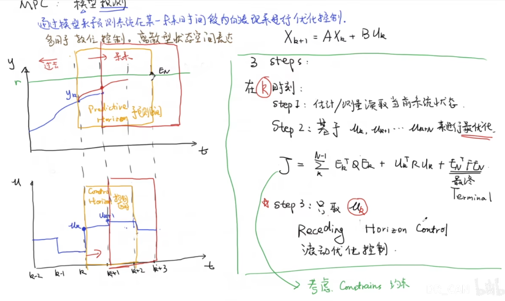

https://blog.csdn.net/qq_44940689/article/details/139808413
## 1.什么是MPC
Model Predictice Control 模型预测控制
本质的想法是建立一个系统的动态模型，并在每个时刻使用的时候预测未来系统的行为。
基于这些预测，执行第一个控制动作来调整系统状态
MPC的四个步骤
- **系统模型化**：建立描述系统动态行为的数学模型，通常是差分方程或微分方程。
-  **预测**：在当前时刻基于系统状态和控制输入，使用模型预测未来一段时间内的系统响应。
- **优化**：基于预测的系统响应，通过求解一个优化问题来计算最优的控制输入序列，以最大化或最小化一个性能指标（如系统响应时间、能耗等）。
- **执行**：根据优化得到的控制输入序列中的**第一个值**，执行这个控制动作，并将实际的系统状态反馈到下一个控制周期中
## 2.二次规划QP/最优化求解
> 还没有具体学过Quadratic Programming，这里简单了解了一下，QP也是一种数学优化方法，可以简单理解为 是对一个有线性约束的二次的目标函数求极值

- 对于MPC，我们可以简单列出一个状态空间方程
$$x(k+1) = Ax(k) + Bu(k)$$
> 其中的变量依次代表 未来状态；当前状态；控制动作（输入）

- 目标函数：
$$J = \sum_{i=1}^{N} \|x(k+i) - x_{ref}\|^2_{Q} + \sum_{i=0}^{M} \|u(k+i)\|^2_{R}$$
- 目标函数就是分别对状态误差进行相应的惩罚，还有就是能量的惩罚
> $\|\cdot\|^2$是范数的平方。在数学展开后，$\|x\|^2_Q$ 其实就是 $x^T Q x$，展开之后就是二次多项式，接下来就是用二次规划求最优值了

## 3.滚动优化控制

- 二次规划中基于未来几秒钟的情况进行最优化，但是MPC系统并不会执行这一整段的操作。
- MPC系统只会执行uk这一段操作（sim2real会有偏差），然后再基于真实的情况进行下一次的最优化。如此的过程，就可以叫作滚动控制优化
## 4. MPC的优劣
- 对比PID，可以处理多个输入的系统，PID只能通过调参去猜，MPC可以设置多个状态因子，考虑多个因子之间的相互影响
- MPC可以设置强力的约束条件

- 但是MPC是基于对未来的预测，这通常需要大量的算力