## 1.Navigation2 理论

### 1.1.Navigation2 的介绍

- **Nav2 (Navigation 2)** 是 ROS 2 环境下最核心的移动机器人自主导航框架。它的终极目标是：**安全地让机器人从 A 点移动到 B 点，且具备处理复杂环境、动态障碍物以及任务逻辑的能力**
- **"容器"与"插件"的分离**
- **核心逻辑：Server 容器，Plugin 插件。**
- **Server 的工作****：负责收发 ROS 消息（Action）、维护地图数据（Costmap）、管理生命周期。**
- **Plugin 的工作：只负责纯粹的数学计算（怎么走、怎么避障）。**

### 1.2.Navigation 架构

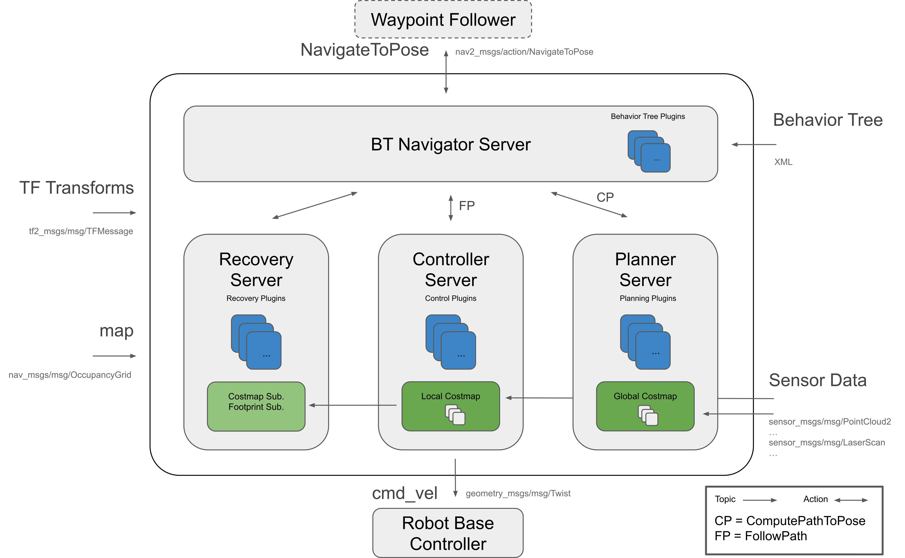

- Nav2 使用行为树调用模块化服务器来完成一个动作。动作可以是计算路径、控制力、恢复或任何其他与导航相关的操作。这些都是通过 ROS Action 服务器与行为树 (BT) 通信的独立节点。
- 上面那张图可以解析为一大三小四个服务来理解

- **一大**：BT Navigator Server 导航**行为树**服务，通过这个大的服务来进行下面三个小服务组织和调用
- 1.Planner Server，规划服务器，其任务是计算完成一些目标函数的路径。根据所选的命名法和算法，该路径也可以称为路线。**说白了就是在地图上找路**
- 2.Controller Server，控制服务器，在 ROS 1 中也被称为局部规划器，是我们跟随全局计算路径或完成局部任务的方法。**说白了就是根据找的路控制机器人走路。**
- 3.Recovery Server，恢复服务器，恢复器是容错系统的支柱。恢复器的目标是处理系统的未知状况或故障状况并自主处理这些状况。**说白了就是机器人可能出现意外的时候想办法让其正常，比如走着走着掉坑如何爬出来。**

### 1.3.代价地图

- 代价地图是一个规则的 2D 网格单元，每个单元包含一个代价值，表示：未知 (Unknown)、空闲 (Free)、被占据 (Occupied) 或膨胀代价 (Inflated cost)
- 核心架构：Layers (图层叠加)

#### 1.3.1.全局代价地图 (Global Costmap)

- 全局代价地图服务于 **Planner Server（全局规划器）**
- 它根据之前 SLAM 扫出来的静态地图，计算出一条从起始点到终点的最优理论路径（那条蓝色的长线）
- 坐标系：**map**
- 全局代价地图包括的图层：

- Static Map Layer：静态地图层，通常都是 SLAM 建立完成的静态地图。
- Obstacle Map Layer：障碍地图层，用于动态的记录传感器感知到的障碍物信息。
- Inflation Layer：膨胀层，在以上两层地图上进行膨胀（向外扩张），以避免机器人的外壳会撞上障碍物。

#### 1.3.2.局部代价地图 (Local Costmap)

- 局部代价地图主要用于**局部的路径规划器**
- 负责躲避。它实时融合激光雷达、深度摄像头的数据，观察脚下有没有突然出现障碍物
- **滚动窗口 (Rolling Window)：** 这是它最大的特点。随着机器人移动，这个小地图会跟着机器人一起走，旧的区域被丢弃，新的传感器数据被填入
- 坐标系：`odom`或`base_link`
- 局部代价地图包括的图层：

- Obstacle Map Layer：障碍地图层，用于动态的记录传感器感知到的障碍物信息。
- Inflation Layer：膨胀层，在障碍地图层上进行膨胀（向外扩张），以避免机器人的外壳会撞上障碍物。

#### 1.3.3.代价地图过滤器（Costmap Filters）

- 代价地图过滤器是作为代价地图插件实现的。这些插件被称为"过滤器"，因为它们通过过滤掩码上标记的空间注释来过滤代价地图。
- 利用代价地图过滤器可以实现以下功能：

- **Keep-out/safety zones (禁行/安全区)**：机器人永远不会进入的区域。
- **Speed restriction areas (限速区)**：机器人进入这些区域后的最大速度将受到限制。
- **Preferred lanes (优先通道)**：用于工业环境和仓库中机器人移动的首选路径。

### 1.4.动作服务器（Action Server）

- 在 Nav2 (Navigation 2) 中，**动作服务器 (Action Server)** 是核心通信机制的基石。不同于简单的服务 (Service) 调用（请求 - 立即响应）或话题 (Topic) 发布（单向数据流），Action Server 专门用于处理**长时间运行、需要反馈、且可以中途取消**的任务。
- 通过动作服务器通信，来计算路径规划、控制机器人运动和恢复。每个动作服务器都有自己独特的 `nav2_msgs` 格式的 `.action` 类型，用于与服务器进行交互。
- 由于任务运行时间较长，Action Servers 还会向其客户端提供 **Feedback (反馈)**。反馈的内容可以是任何信息，它与请求 (Request) 和结果 (Result) 类型一起定义在 ROS 的 `.action` 文件中。

### 1.5.生命周期

#### 1.5.1.生命周期节点

[Managed nodes](https://design.ros2.org/articles/node_lifecycle.html)

Nav2 引入了 `Managed Nodes` 节点的概念，让节点有了状态，从而听从指挥开始工作。一共有四个状态：

- `Unconfigured`：

- 节点刚启动，同时等待配置指令

- `Inactive`：

- 节点加载好了参数，分配好了内存，同时读取了地图，但是还没开始工作。等待工作指令

- `Active`：

- 节点开始工作。只有在工作状态，`Planner` 和`Controller`才能工作

- `Finalized`：

- 节点关闭，释放所有资源

对应的回调函数

- `on_configure()`: 加载参数，建立 Publisher/Subscriber
- `on_activate()`: 真正激活 Publisher，开始处理数据
- `on_deactivate()`: 暂停发布，停止处理，保留配置
- `on_cleanup()`: 清除内存，重置为 Unconfigured

#### 1.5.2.生命周期管理器

`lifecycle_manager` 切换节点的工作状态

1. **加载地图 (Map Server):** 必须先有地图。 -> `Configure` -> `Activate`
2. **定位 (AMCL):** 有了地图，才能让定位算法初始化粒子群。 -> `Configure` -> `Activate`
3. **路径规划 (Planner Server):** 有了地图和定位，才能算路。 -> `Configure` -> `Activate`
4. **控制器 (Controller Server):** 前面都好了，才能准备开车。 -> `Configure` -> `Activate`
5. **导航中枢 (BT Navigator):** 最后启动总指挥，因为它依赖以上所有服务。

- `lifecycle_manager` 确保了节点的启动顺序

#### 1.5.3.绑定 bond

- 用于处理某个节点的异常
- `lifecycle_manager` (Server) 和每一个被管理的节点 (Client) 之间建立一条特殊的连接，当某个被管理的节点崩溃了，`lifecycle_manager`直接触发超级防反（保护机制，把其他节点从`active`变成`inactive`

### 1.6.行为树 BT

[行为树 Behavoir Tree 入门教程 | 讲的最清晰的教程 (大概)_行为树教程-CSDN 博客](https://blog.csdn.net/JeSuisDavid/article/details/139619212)

在 Nav2 中用 XML 文件来描述树

#### 1.6.1.行为树的基本构成

行为树由**节点 (Nodes)** 组成。每一次逻辑更新（通常是几十毫秒一次），信号（我们称为 **Tick**）从根节点出发，遍历整棵树。每个节点被 Tick 后，必须返回以下三种状态之一：

1. **SUCCESS (成功)**
2. **FAILURE (失败)**
3. **RUNNING (运行中)**

同时，节点也有四大类：

- 控制流节点 (`Control Flow Nodes`)

负责指挥信号的流动

- `Sequence` (序列节点) `->`

- **逻辑：AND (与)**。
- **规则：** 依次执行子节点。如果所有子节点都返回 `SUCCESS`，它才返回 `SUCCESS`。只要有一个子节点返回 `FAILURE`，它立刻中断并返回 `FAILURE`。

- `Fallback / Selector` (选择/回退节点) `?`

- **逻辑：**OR (或)。
- **规则：** 依次执行子节点。只要有一个返回 `SUCCESS`，它就立刻返回 `SUCCESS`（任务完成）。只有所有子节点都 `FAILURE`，它才返回 `FAILURE`。

- `Parallel` (并行节点) `||`

- 执行节点 (`Leaf Nodes - Action`)

人如其名，就是干活的节点，通常对应的是 Action Client

- `ComputePathToPose`: 调用 Planner Server 算路。
- `FollowPath`: 调用 Controller Server 走路。
- `Spin`, `Wait`, `BackUp`: 调用 Behavior Server 救急。

- 条件节点 (`Leaf Nodes - Condition`)

负责检查环境，只返回 SUCCESS 或 FAILURE

- `IsBatteryLow`
- `GoalReached`
- `IsPathValid`

- 装饰节点 (`Decorator Nodes`)

负责装饰其他的节点，修改其他子节点的行为

- `RateController`: 限制频率（例如：别 100Hz 规划路径，限制在 1Hz 就行）。
- `Retry`: 重试（例如：规划失败别急着报错，重试 3 次再说）。
- `Inverter`: 取反（把成功变失败，失败变成功）。

掌握了上面的节点，看懂下面这个树就很简单了

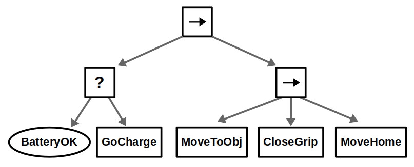

#### 1.6.2.节点间通信--Blackboard

黑板（`Blackboard`）本质上就是一个**类型安全的字典（Dictionary/Map）**

字典是属于**这棵行为树**的。树里的所有节点都能访问它，但树外面的程序（比如其他的 ROS 节点）无法直接访问

### 1.7.规划器服务器（Planner Server)

- 它的任务：在地图上画出一条从起点 A 到终点 B 的线。它不关心机器人现在速度是多少。它只关心静态的地图墙壁在哪里。
- 输入：

- **目标点 (Goal Pose)**: 你想去哪？
- **全局代价地图 (Global Costmap)**: 基于整个静态地图构建的障碍物信息。

- 输出：全局路径 (Global Path): 一连串密集的坐标点列表 。
- 特点：

- **频率低：** 通常只在任务开始时算一次，或者每隔几秒重算一次。
- **视野大：** 看到的是整个世界的全貌。

- 神秘插件：还没学到还没用到（等到时候填坑吧）

- `_NavFn / Theta_`_: 最经典的 A*_ 或 Dijkstra 算法。算出的路是格栅化的（锯齿状），适合大部分差速/全向机器人。
- `Smac Planner`**:** 适用于阿克曼转向（像汽车一样）_的机器人。它算出的路考虑了转弯半径，还可以处理全方位（Omni）或混合 A*_ 算法。

### 1.8.控制器服务器 (Controller Server)

- 它的任务：拿着 Planner 给的路线，让机器人避开眼前的障碍物
- **输入：**

- **全局路径 (Global Path):** Planner 给的那条线。
- **里程计 (Odometry):** 机器人现在的速度和位置。
- **局部代价地图 (Local Costmap):这是关键！** 它只看机器人周围 3-5 米的范围，是实时更新的（包含雷达扫到的动态障碍物）。

- **输出：**

- **速度指令 (**`**cmd_vel**`**):** 告诉底盘 `Linear X` (前进速度) 和 `Angular Z` (转弯速度)。

- **特点：**

- **频率高：** 疯狂计算，通常 20Hz - 50Hz（每秒算 20 次以上）。
- **视野小：** 只盯着脚下的路。

- 依旧神秘插件：依旧还没学，等我 nav2 实操之后来补

- 这是 Nav2 调优的深水区，不同的插件决定了机器人走得"顺不顺"：
- **DWB (Dynamic Window Approach):** 经典的 DWA 升级版。原理是模拟未来几秒内所有可能的速度组合，选出一条既贴合路径又不撞墙的轨迹。**最常用，适合入门。**
- **MPPI (Model Predictive Path Integral):****现在的明星算法**。基于模型预测控制。不需要复杂的参数调整，就能走出极其丝滑的绕障路径，甚至能处理高速动态环境。
- **RPP (Regulated Pure Pursuit):** 纯追踪算法。主要用于**阿克曼结构（汽车）**，就像车总是盯着前方一个预瞄点开。

### 1.9.恢复服务器 (Recovery / Behavior Server)

- 它的任务：当出现紧急情况的时候，会被行为树呼叫并作出反映
- 特点：通常是开环的，不依赖于路径规划
- 常用插件：

- **Costmap Clearing:** 强制把某个区域的障碍物记忆抹除（万一之前是传感器噪声呢？）。
- **Spin:** 原地转圈，试图找到新的出路。
- **BackUp:** 盲目倒车（Controller 通常不允许盲目倒车，必须要有路径，但 Recovery 可以特权倒车）。
- **DriveOnHeading:** 强制朝某个方向开一段距离。

### 1.10.AMCL（Adaptive Monte Carlo Localization）

AMCL 的本质是**贝叶斯滤波**的一种非参数化实现，解决的是机器人借助传感器的定位问题。

我们在 RVIZ2 看到的神秘绿色粒子就是 ACML 工作时产生的东西

贝叶斯滤波，本质上是根据'当前的观测'和'刚才的预测'之间的偏差，来不断修正对真相猜测的算法。呃卡尔曼滤波好像是贝叶斯滤波的特殊情况吧，（感觉是概率论的东西。后面再填坑吧。

下面会介绍一点点参数，但更多参数还是在官网里看吧 [AMCL — Nav2 1.0.0 documentation](https://docs.nav2.org/configuration/packages/configuring-amcl.html#parameters)

#### 1.10.1.运动更新

输入：里程计数据（odom）

特点：粒子根据里程计的输入运动，同时加入一点 `高斯噪声`，让粒子的运动更加不确定一点

参数：就是这一坨 alpha。alpha 的值越大，高斯噪声越大，适用于里程计较烂的情况
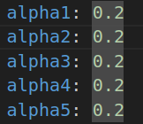

#### 1.10.2.观测更新

输入：激光雷达数据（Laser Scan）

特点：根据雷达扫描到墙壁的数值和粒子的位置，调整粒子的权重。粒子位置和雷达扫描到的位置匹配的权重会更高

参数：

- z_hit：这个是正常击中墙壁的权重。越高意味着环境干扰少，雷达打到的大部分都是墙壁
- z_max：这个是雷达的数据完全失效的权重
- z_rand：这个是随机分，用于抗电磁干扰或雷达的短时间异常
- z_short：这个是意外遮挡。如果环境里动态障碍多，就加大这个权重
    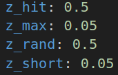

#### 1.10.3.重采样

特点：算法根据刚才的权重重新生成一批粒子，权重高的粒子能被多次复制，而权重低的粒子就可能会消失。

这也就是在 RVIZ2 看到粒子快速收敛的原因

#### 1.10.4.局限性

- **对称环境：**雷达扫描到的两边数据相同，很难调整权重
- **瞬移：**如果机器人一下子被转移到另一个地方，并且没有重新设置初始点，那观测更新就会不断降低原有粒子的权重，导致机器人可能就会去世
## 2.Navigation2 实践

### 2.1.Navigation2 的安装

- navagation2

```
sudo apt install ros-$ROS_DISTRO-navigation2
```

- nav2_bringup 功能包

```
sudo apt install ros-$ROS_DISTRO-nav2-bringup
```
### 2.2.配置 launch 并启动 Navigation2

```
import os
import launch
import launch_ros
from ament_index_python.packages import get_package_share_directory
from launch.launch_description_sources import PythonLaunchDescriptionSource


def generate_launch_description():
    # 获取与拼接默认路径
        #功能包的目录
    fishbot_navigation2_dir = get_package_share_directory(
        'ep_navigation2')
        #nav2_bringup 功能包的目录
    nav2_bringup_dir = get_package_share_directory('nav2_bringup')
        #这个功能包对应的 rviz 配置文件
    rviz_config_dir = os.path.join(
        nav2_bringup_dir, 'rviz', 'nav2_default_view.rviz')

    # 创建 Launch 配置
        #虚拟时间配置
    use_sim_time = launch.substitutions.LaunchConfiguration(
        'use_sim_time', default='true')
        #地图配置文件
    map_yaml_path = launch.substitutions.LaunchConfiguration(
        'map', default=os.path.join(fishbot_navigation2_dir, 'maps', 'room.yaml'))
        #参数配置文件
    nav2_param_path = launch.substitutions.LaunchConfiguration(
        'params_file', default=os.path.join(fishbot_navigation2_dir, 'config', 'nav2_params.yaml'))

    return launch.LaunchDescription([
        # 声明新的 Launch 参数
        launch.actions.DeclareLaunchArgument('use_sim_time', default_value=use_sim_time,
                                             description='Use simulation (Gazebo) clock if true'),
        launch.actions.DeclareLaunchArgument('map', default_value=map_yaml_path,
                                             description='Full path to map file to load'),
        launch.actions.DeclareLaunchArgument('params_file', default_value=nav2_param_path,
                                             description='Full path to param file to load'),

        launch.actions.IncludeLaunchDescription(
            PythonLaunchDescriptionSource(
                #把参数传递给子 launch
                [nav2_bringup_dir, '/launch', '/bringup_launch.py']),
            # 使用 Launch 参数替换原有参数
            launch_arguments={
                'map': map_yaml_path,
                'use_sim_time': use_sim_time,
                'params_file': nav2_param_path}.items(),
        ),
        launch_ros.actions.Node(
            package='rviz2',
            executable='rviz2',
            name='rviz2',
            arguments=['-d', rviz_config_dir],
            parameters=[{'use_sim_time': use_sim_time}],
            output='screen'),
    ])
```
- 刚开始启动会出现诸如此类的报错，意思大概是话题无法读取和发布位置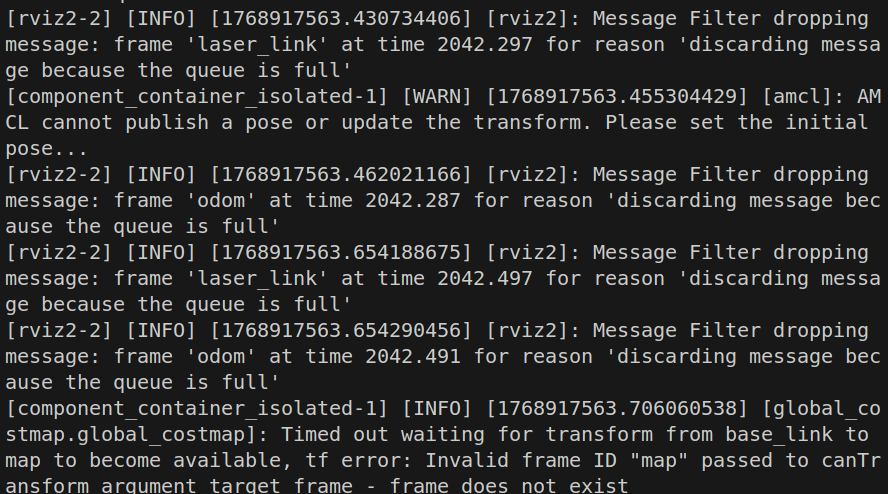
- 查看 TF 树，发现其实这是因为没有 map 坐标系，机器人自然无法定位。此时只需要在 RVIZ2 中估计初始位置即可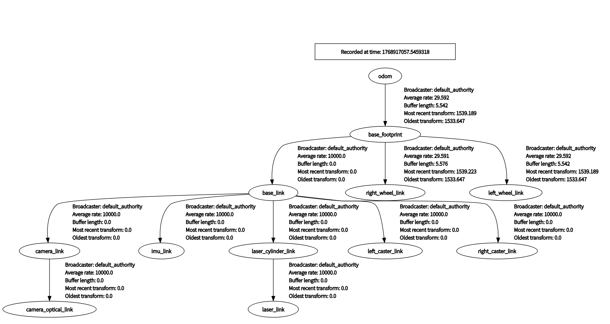
- 上面这一层就是全局地图，靠近小车的颜色较深的地方就是局部代价地图，分别对应

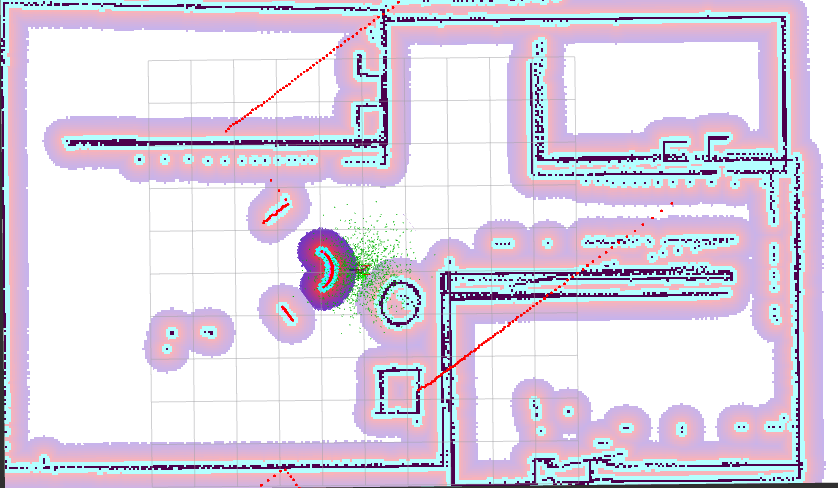

### 2.3.设置 Filter

这里以设置 keepout filter 为例

这一块的操作主要分为三步

1.加一个禁区地图

2.在 launch.py 中加两个服务节点发布信息

3.启用过滤器插件

#### 2.3.1.禁区地图

这一步看似简单，实则有点阴间。

因为在乌邦图里好像没有什么可以好处理格式为`.pgm`的图片的软件，而且强行把`.pgm`转为`.jpg`会失去一些像素信息。所以在这里选择用 opencv 画一个黑框框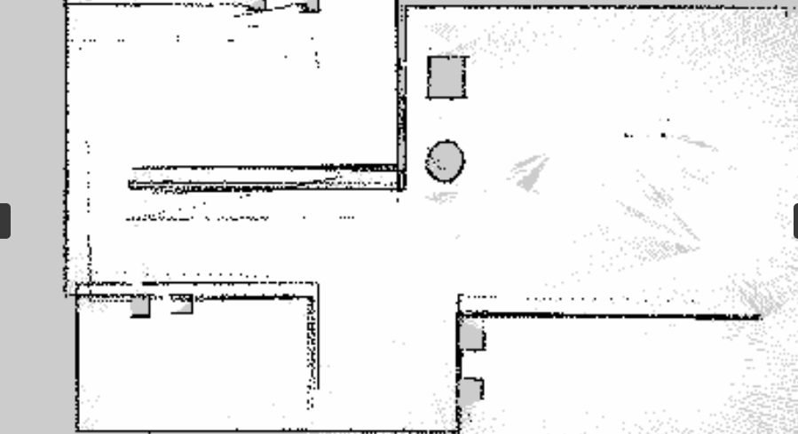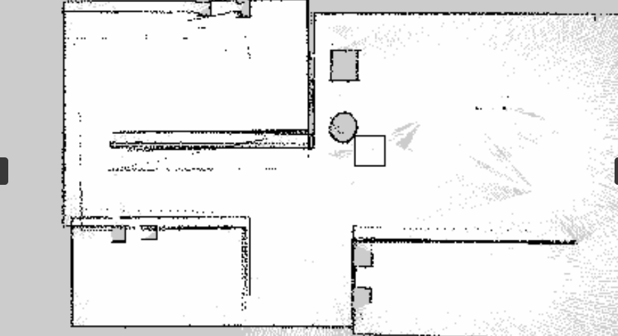

拿到地图了，同时也要设置`.yaml`文件，这个简单，就直接复制原图片的`.yaml`就可以了（改一下 image）

#### 2.3.2.launch

1. 这个节点的名字是`'filter_mask_server'`用于发布禁区地图的信息。

2. 值得注意的是，他把节点话题重映射为了`'/keepout_filter_mask'`

```
Node(
            package='nav2_map_server',
            executable='map_server',
            name='filter_mask_server',
            output='screen',
            parameters=[{'use_sim_time': use_sim_time,
                         'yaml_filename': keepout_mask_path}],
            remappings=[('/map', '/keepout_filter_mask')] # 避免和主地图冲突
        ),
```

2. 这个节点的名字叫`'costmap_filter_info_server'`用于解释禁区地图上的信息。

3. `'type': 0`是这个节点的核心，其中 0 代表禁行，1 代表限速
4. `mask_topic`: 告诉它去哪里找图片数据。必须填上面那个节点重映射后的名字 `"/keepout_filter_mask"`
5. `filter_info_topic`: 发布这个解释信息的话题名
6. `multiplier`: 系数。对于 Keepout 来说通常是 `1.0`。如果是限速区，这个数字可能用来计算具体限速多少

```
Node(
            package='nav2_map_server',
            executable='costmap_filter_info_server',
            name='costmap_filter_info_server',
            output='screen',
            parameters=[{'use_sim_time': use_sim_time,
                         'type': 0, # 0 代表 Keepout
                         'filter_info_topic': "/keepout_costmap_filter_info",
                         'mask_topic': "/keepout_filter_mask",
                         'base': 0.0,
                         'multiplier': 1.0}],
        ),
```

3. 这个节点的名字叫`'lifecycle_manager_costmap_filters'`用于管理禁行区的节点的生命周期

```
Node(
            package='nav2_lifecycle_manager',
            executable='lifecycle_manager',
            name='lifecycle_manager_costmap_filters',
            output='screen',
            parameters=[{'use_sim_time': use_sim_time,
                         'autostart': True,
                         'node_names': ['filter_mask_server', 'costmap_filter_info_server']}]
        ),
```

#### 2.3.3.过滤器插件

- 在配置文件中加上插件
- 注意在局部地图和全局地图都要加上
- 特别注意一下 `filter_info_topic`一定要抓准了发布信息的话题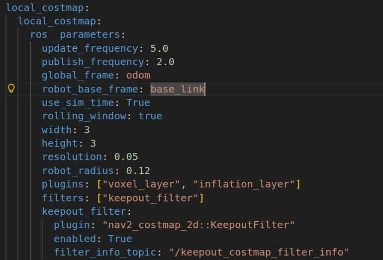

```
filters: ["keepout_filter"]
      keepout_filter:
        plugin: "nav2_costmap_2d::KeepoutFilter"
        enabled: True
        filter_info_topic: "/keepout_costmap_filter_info"
```

#### 2.3.4.运行效果

小车会检测到周围有一个这样的框框

此时，再想让小车跑到框框外边，就会触发恢复器的操作，最后规划器也找不到路径出去了。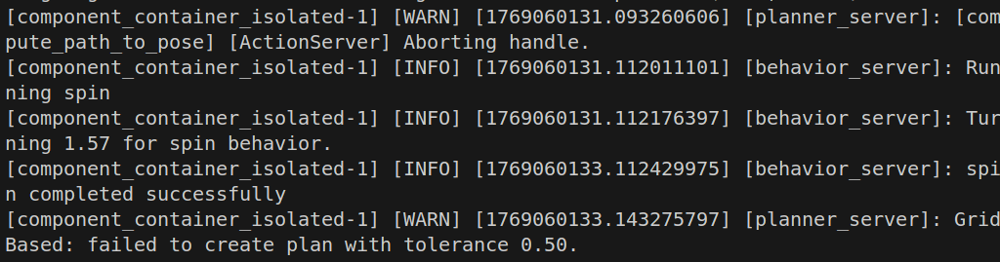

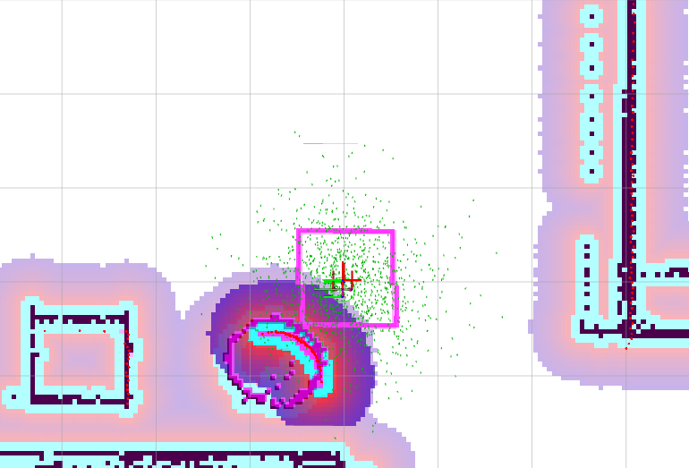

### 2.4.设置初始点和目标点

#### 2.4.1. 设置初始点

当然可以用 RVIZ2 的设置形式，但是用代码写应该会更权威一点。这段 ROS 代码的核心逻辑就是，创建 `geometry_msgs::msg::PoseWithCovarianceStamped` 类的消息，通过 `initial_pose_pub_`发布到`/initialpose` 这个话题上。

**initial.hpp**
```cpp
#pragma once

#include "rclcpp/rclcpp.hpp"
#include "geometry_msgs/msg/pose_with_covariance_stamped.hpp"

class Initial : public rclcpp::Node {
public:
    //构造函数
    Initial();
private:
    //设置初始位姿态函数
    void set_initial_pose();
    //定时器
    rclcpp::TimerBase::SharedPtr timer_;
    //消息发布者
    rclcpp::Publisher<geometry_msgs::msg::PoseWithCovarianceStamped>::SharedPtr initial_pose_pub_;
};
```

**initial.cpp**
```cpp
#include "initial.hpp"

//初始化构造函数
Initial::Initial() : Node("initial_pose_publisher"){
    initial_pose_pub_ = this->create_publisher<geometry_msgs::msg::PoseWithCovarianceStamped>("initialpose", 10);
    timer_ = this->create_wall_timer(std::chrono::seconds(1),std::bind(&Initial::set_initial_pose,this));
}
void Initial::set_initial_pose(){
    timer_->cancel();
    auto msg = geometry_msgs::msg::PoseWithCovarianceStamped();

    msg.header.frame_id = "map";
    msg.header.stamp = this->now();

    msg.pose.pose.position.x = 0.0;
    msg.pose.pose.position.y = 0.0;
    msg.pose.pose.position.z = 0.0;

    msg.pose.pose.orientation.w = 1.0;
    msg.pose.pose.orientation.x = 0.0;
    msg.pose.pose.orientation.y = 0.0;
    msg.pose.pose.orientation.z = 0.0;

    msg.pose.covariance[0] = 0.25;
    msg.pose.covariance[7] = 0.25;
    msg.pose.covariance[35] = 0.068;

    initial_pose_pub_->publish(msg);

    RCLCPP_INFO(this->get_logger(), "成功发布初始位姿");
}
```

#### 2.4.2. 设置目标点

同样可以通过代码设置导航目标点，发布到 `/goal_pose` 话题。

**move.hpp**
```cpp
#pragma once
#include "rclcpp/rclcpp.hpp"
#include "geometry_msgs/msg/pose_stamped.hpp"

class Move2Place : public rclcpp::Node
{
    public:
        Move2Place();
    private:
        void move2place();
        void get_pose();
        rclcpp::TimerBase::SharedPtr timer_;
        geometry_msgs::msg::PoseStamped::SharedPtr p;
        rclcpp::Publisher<geometry_msgs::msg::PoseStamped>::SharedPtr move_pose_pub_;
};
```

**move.cpp**
```cpp
#include "move.hpp"

Move2Place::Move2Place():Node("goal_publisher"){
    move_pose_pub_ = this->create_publisher<geometry_msgs::msg::PoseStamped>("goal_pose", 10);
    timer_ = this->create_wall_timer(std::chrono::seconds(5), std::bind(&Move2Place::move2place, this));

}
void Move2Place::move2place(){
    timer_->cancel();
    p = std::make_shared<geometry_msgs::msg::PoseStamped>();
    auto msg = geometry_msgs::msg::PoseStamped();
    get_pose();
    if (p != nullptr)
    {
        msg = *p;  // 拷贝 p 指向的数据到 msg
        RCLCPP_INFO(this->get_logger(), "成功发布目标位置");
    }
    else
    {
        // p 为空时的默认值
        msg.pose.position.x = 0.0;
        msg.pose.position.y = 0.0;
        msg.pose.position.z = 0.0;
        msg.pose.orientation.w = 1.0;
    }

    move_pose_pub_->publish(msg);

}

void Move2Place::get_pose(){
    p->header.stamp = this->now();
    p->header.frame_id = "map";

    p->pose.position.x = -1.0;
    p->pose.position.y = -2.0;
    p->pose.position.z = 0.0;

    p->pose.orientation.w = 1.0;
    p->pose.orientation.x = 0.0;
    p->pose.orientation.y = 0.0;
    p->pose.orientation.z = 0.0;

}
```

**main.cpp**
```cpp
#include "initial.hpp"
#include "move.hpp"

int main(int argc, char ** argv){
    rclcpp::init(argc, argv);

    auto initial_node = std::make_shared<Initial>();
    auto move_node = std::make_shared<Move2Place>();

    rclcpp::ExecutorOptions options;
    rclcpp::executors::SingleThreadedExecutor executor(options);
    executor.add_node(initial_node);
    executor.add_node(move_node);
    executor.spin();

    rclcpp::shutdown();
    return 0;
}
```

#### 2.4.3. 关键设计点

1. **消息类型选择**
   - **初始位姿**: 使用 `PoseWithCovarianceStamped`，包含协方差信息，表示位姿的不确定性
   - **目标位姿**: 使用 `PoseStamped`，不需要不确定性信息

2. **定时器设计**
   - 初始位姿：1 秒延迟，给系统足够时间启动
   - 目标位姿：5 秒延迟，让机器人有时间完成初始定位

3. **话题名称**
   - 初始位姿:`/initialpose`(标准 Nav2 话题)
   - 目标位姿:`/goal_pose`(自定义话题名称)

4. **坐标系**
   - 所有位姿都使用"map"坐标系
   - 符合 Nav2 的标准要求

### 2.5.参数配置

[📎nav2_params.yaml](https://hitwhlc.yuque.com/attachments/yuque/0/2026/yaml/61267216/1769149011301-16517f8e-8ef6-4891-961f-fabbb618e73e.yaml)

nav2 的初始参数配置，在目录`/opt/ros/humble/share/nav2_bringup/params`下

#### 2.5.1.amcl 定位模块相关参数

- `**use_sim_time: True**`: 仿真环境必开。**实机调试必须改为** `**False**`。
- `**alpha1**` **~** `**alpha4**` **(0.2)**: **[关键调试项]** 里程计运动噪声模型。

- 如果你的机器人轮子打滑严重或里程计很飘，需要**调大**这些值（告诉算法"我不信任里程计"）。
- `alpha1`: 旋转引起的旋转噪声。
- `alpha2`: 平移引起的旋转噪声。
- `alpha3`: 平移引起的平移噪声。
- `alpha4`: 旋转引起的平移噪声。

- `**min_particles**` **(500) /** `**max_particles**` **(2000)**: **[性能平衡项]** 粒子数量。

- 粒子越多，定位越准，但 CPU 占用越高。

- `**scan_topic**`: 激光雷达的话题名，需与实际话题一致。
- `**robot_model_type**`: `"nav2_amcl::DifferentialMotionModel"` (差速) 或 `"omni"` (全向)。
- `**z_hit**` **(0.5) /** `**z_rand**` **(0.5)**: 传感器模型参数。
- `**update_min_d**` **(0.25) /** `**update_min_a**` **(0.2)**: 触发定位更新的阈值。

- 机器人移动 0.25 米 或 旋转 0.2弧度 更新一次粒子。调小可以提高更新频率，但增加计算量。

#### 2.5.2.bt_navigator 行为树导航相关参数

- `**bt_loop_duration**` **(10)**: 行为树 tick 的间隔（毫秒）。10ms = 100Hz。
- `**default_server_timeout**`: 等待 Action Server（如规划器、控制器）响应的超时时间。
- `**plugin_lib_names**`: 这里列出了一大堆插件，实际上就是告诉 Nav2 有哪些行为树节点可用

#### 2.5.3.controller_server 控制服务器相关参数

它接收全局路径，计算具体的速度指令 (`cmd_vel`) 发送给底盘。这里使用的是 **DWB Local Planner**。

- `**controller_frequency**` **(20.0)**: 控制频率。20Hz 意味着每秒发送 20 次速度指令。
- `**FollowPath**` **(DWB 参数)**:
- **速度限制 [绝对核心]**:

- `min_vel_x` / `max_vel_x`: 前进速度范围。
- `min_vel_y` / `max_vel_y`: 差速车设为 0；全向车需设置。
- `max_vel_theta`: 最大旋转角速度。

- **加速度限制 [绝对核心]**:

- `acc_lim_x`, `acc_lim_theta`: **必须根据电机和底盘的实际物理能力设置**。设太大会导致规划出的速度机器跑不到，导致控制滞后；设太小机器人反应迟钝。

- `**sim_time**` **(1.7)**: **[关键调试项]** 前向模拟时间。

- 机器人"预测"未来 1.7 秒的运动轨迹来避障。
- **调试技巧**：如果机器人经常撞到动态障碍物或反应慢，**减小**此值；如果机器人在此宽阔场地不敢走高速，**增大**此值。

- `**vx_samples**` **(20) /** `**vtheta_samples**` **(20)**: 采样密度。数值越高规划越精细，但由 CPU 决定上限。

#### 2.5.4.local_costmap 局部代价地图相关参数

- `**update_frequency**` **(5.0)**: 地图更新频率。如果雷达是 10Hz，这里设 5-10Hz 比较合适。
- `**rolling_window: true**`: 必须为 true，表示地图随机器人移动。
- `**width**` **(3) /** `**height**` **(3)**: **[关键调试项]** 局部地图大小（米）。
- `**resolution**` **(0.05)**: 地图分辨率，5cm 一个格子。
- `**inflation_layer**` **(膨胀层)**: **[最容易出问题的部分]**

- `inflation_radius` (0.55): 障碍物膨胀半径。**必须大于机器人半径**，否则机器人会认为它可以贴着墙走，导致擦碰。
- `cost_scaling_factor` (3.0): 代价衰减因子。

- 值越大，膨胀层代价衰减越快（允许离障碍物近一点）。
- 值越小，膨胀层越"平缓"，机器人会倾向于远离障碍物行走（走在路中间）。

- `**voxel_layer**` **(体素层)**: 处理 3D 障碍物或 2D 雷达数据。

- `observation_sources: scan`: 数据源。
- `raytrace_max_range`: 清除障碍物的最大距离。
- `obstacle_max_range`: 标记障碍物的最大距离。

#### 2.5.5.global_costmap 全局代价地图相关参数

- `**update_frequency**` **(1.0)**: 更新频率可以低一点，因为静态地图基本不变。
- `**robot_radius**` **(0.22)**: 机器人的物理半径（圆形底盘）。如果是方形底盘，需改用 `footprint` 参数，格式为 `[[x1, y1], [x2, y2], ...]`。
- `**plugins**`:

- `static_layer`: 加载 `map_server` 提供的静态地图。
- `obstacle_layer`: 实时雷达数据（用于规划时避开新出现的障碍物）。
- `inflation_layer`: 同局部地图，用于让规划出的路径与墙壁保持距离。

#### 2.5.6.planner server 全局规划器相关参数

- `**planner_plugins: ["GridBased"]**`: 使用 NavFn 规划器（类似 ROS1 的 global_planner）。
- `**use_astar**` **(false)**:

- `false`: 使用 Dijkstra 算法（保证最短路径，计算量稍大，适合栅格地图）。
- `true`: 使用 A* 算法（速度快，不仅看距离还看启发函数）。

- `**tolerance**` **(0.5)**: 如果目标点被占据（例如在墙里），允许规划到距离目标点 0.5 米内的最近空闲点。

#### 2.5.7.behavior_server 恢复行为相关参数

- `**costmap_topic**`: 用于检测碰撞的地图。
- `**spin**` **/** `**backup**` **/** `**wait**`:
- 这些插件定义了具体的恢复动作。
- `**simulate_ahead_time**` **(2.0)**: 在执行恢复动作（如后退）时，预测未来 2 秒是否会撞到东西。

#### 2.5.8.velocity_smoother 速度平滑器相关参数

- `**smoothing_frequency**` **(20.0)**: 平滑处理频率。
- `**feedback: "OPEN_LOOP"**`:

- `OPEN_LOOP`: 基于上一次发送的命令进行平滑（假设底盘完美执行）。
- `CLOSED_LOOP`: 基于里程计反馈的实际速度进行平滑（更安全，但如果里程计滞后会引起振荡）。

- `**max_accel**` **/** `**max_decel**`:

- **重要调试**：这里的加减速限制应该比 `Controller Server` 里的限制**更严格或相等**。它是最后一道防线，保证输出给底盘的指令平滑。

- `**deadband_velocity**`: 死区速度。消除微小的噪音指令。
